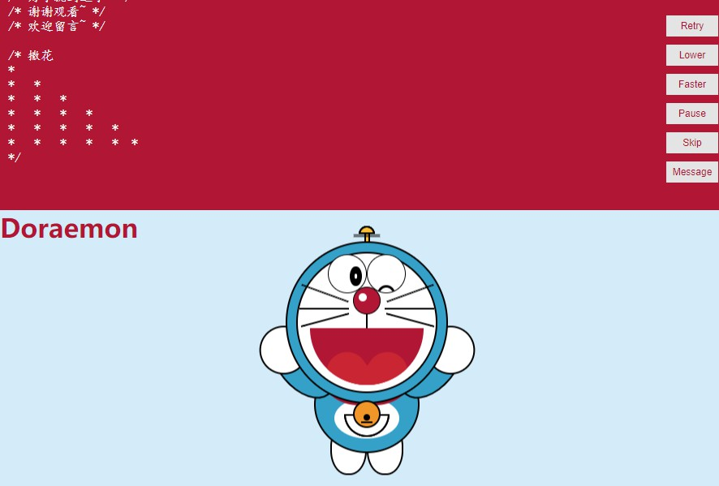

# animation-Doraemon
This is an example of a display CSS drawing graphics. The main feature is that the drawing process is dynamic, so that the user can clearly see the whole drawing process. The user can slow down or speed up the drawing process. I also added one audio, make the user more cheerful, finally I add the function of message, so, welcome to leave a message to me ~

# Project Screenshot
